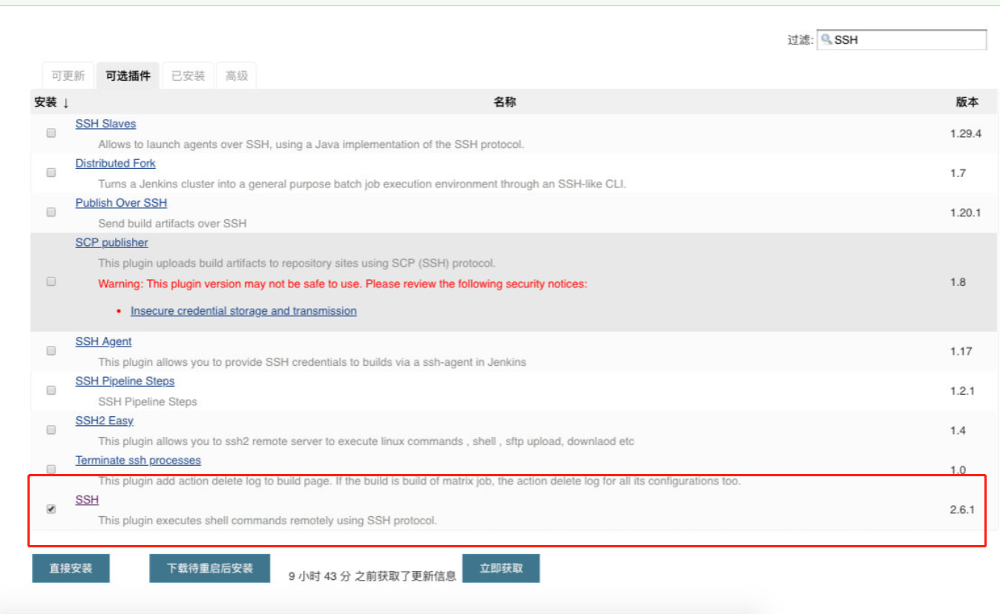
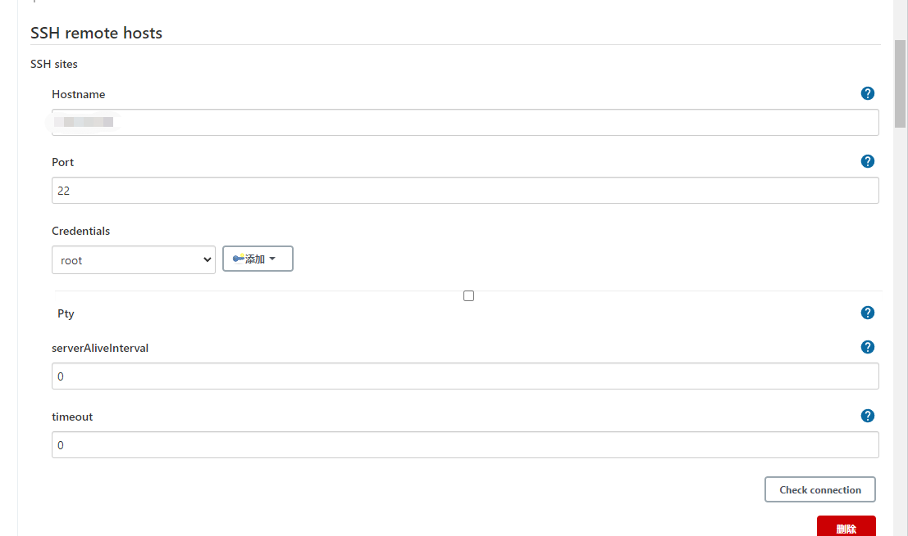
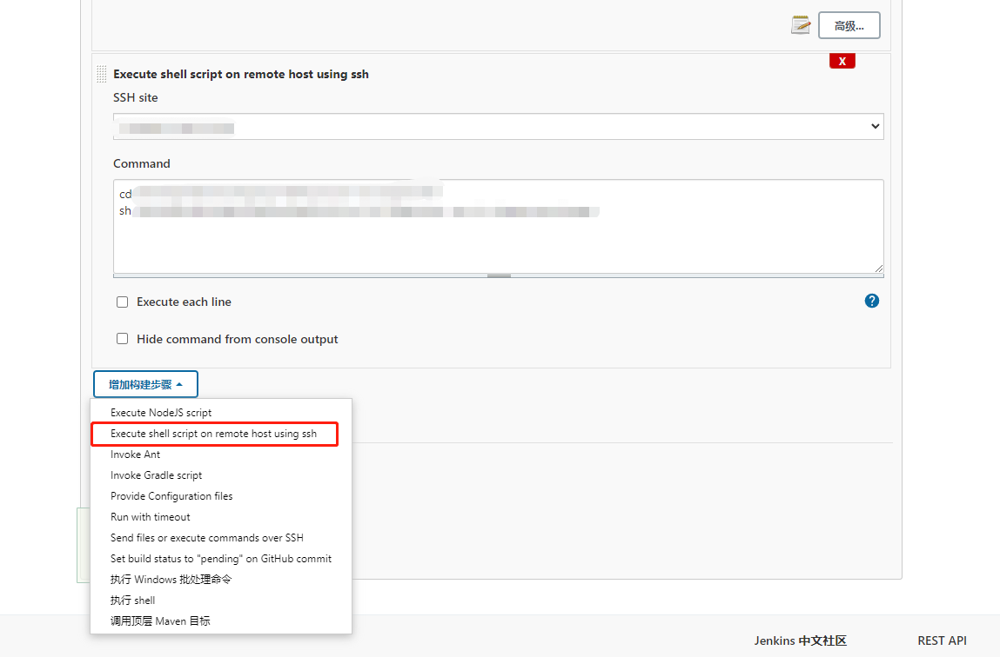

通过Docker启动Jenkins，构建步骤中的"执行shell"是容器内shell，而非宿主机

如果想以宿主机方式执行shell命令，应该通过SSH以远程连接的方式进行，步骤如下：

系统管理->插件管理->可选插件
```
搜索SSH，如果没有说明已安装过，则跳过
```


系统管理->系统配置->SSH remote hosts
```
添加Hostname、Port、用户名密码等信息
```


配置->构建->增加构建步骤->Execute shell script on remote host using ssh
```
SSH site 选择宿主机信息，添加shell命令
```

